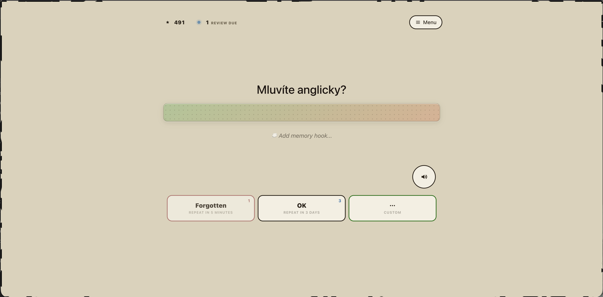
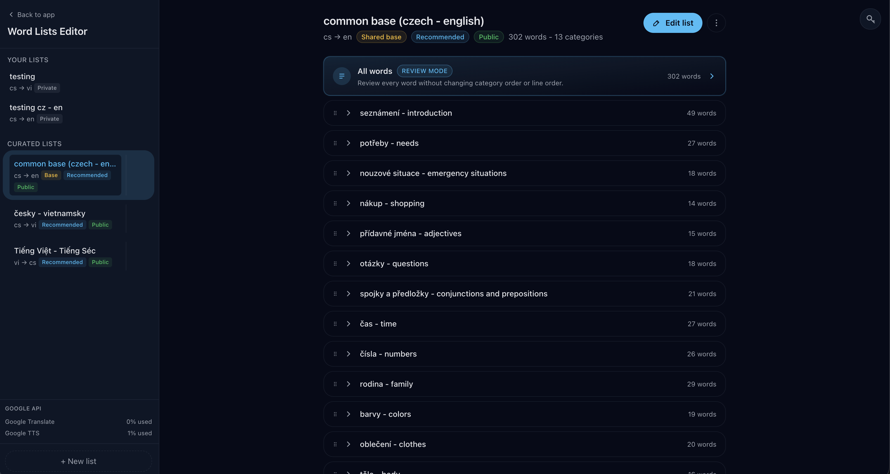
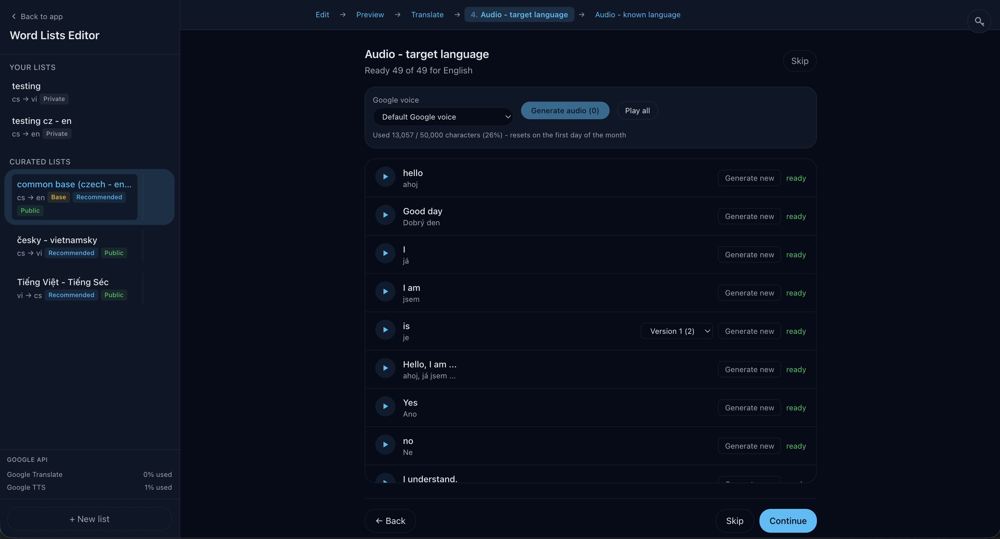

# Get Word

Multilingual language learning app for custom language pairs.

## What is already in the app

- Study words and phrases with spaced repetition in card mode.
- Choose configurable learning language pairs.
- Use curated word lists, fork lists, and create custom list of words and phrases.
- Generate translations and pronunciation audio for list items.
- Play pronunciation audio and reuse already generated audio where possible.
- Add personal memory hooks.
- Practice with lightweight minigames mixed into the learning flow.
- Sign in with email (one-time code) or Google via Supabase Auth.
- Use the app as an installable PWA.

## Tech stack

- **Next.js 16** (React 19)
- **Supabase PostgreSQL**
- **ArDrive Turbo / Arweave** for generated audio storage
- **Supabase Auth** for email + Google sign-in (the app mints its own session)
- **Google TTS (text to speech)**
- **OpenRouter BYOK (bring your own keys)**
- **Drizzle ORM** (`drizzle-orm`, `drizzle-kit`)
- **Tailwind v4** (compiled by Next/PostCSS from `app/tailwind.css`)
- **Vitest + Testing Library** for tests

Designed for **Vercel** deployment.

## Development

For local setup, environment variables, database operations, OpenRouter OAuth,
and deployment notes, see [DEVELOPMENT.md](DEVELOPMENT.md).

## Preview

  
        
  
        
  
        
  

## Future plans

**Set up own goal** 
Users can define their own study goals and track usage and fulfillment over
time. Daily sessions can be configured for short study blocks such as 2, 5, or
10 minutes.

**Motivational stake** 
Checkmate yourself to win: users can put money at stake and decide where it
goes if they do not fulfill their own goal. The recipient can be a friend, an
organization, or support for the app. Execution will be managed by a smart
contract.

**Notifications and reminders** 
Help users remember to keep learning the language they want to know.

**AI tutor** 
Add a chatbot agent that can configure the app through conversation with the
user, help select or compose word lists, and chat with the user in the language
they are learning to simulate a conversation with another person.

**More minigames and puzzles** 
Add smaller puzzle-like games so users can learn language through play.

**Words explorer** 
Add a wizard for easier composition of words and phrases that users want to
learn.

**Creation of word lists** 
Add more words and phrases in curated lists, including more versions for other
languages. Focus on language-specific cases and lists that better cover the
cultural and grammatical uniqueness of each language.

**Voice check** 
Check pronunciation.
